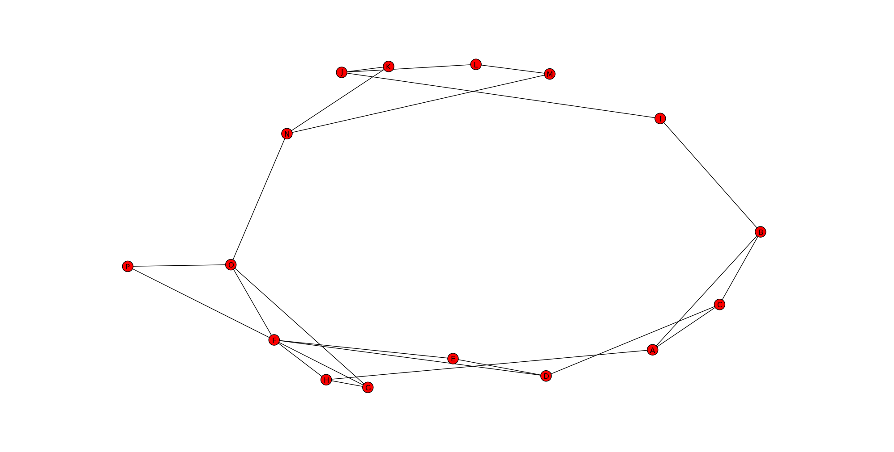

# Comp3331 - Networking Assignment #

## Algorithm ##
We were able to reduce all of the variations of routing: Least Loaded Path,
Shortest Hop Path and Shortest Delay Path into formulation of Djikstras
algorithm with different cost functions.

* **Least Loaded Path**: The cost function is equivalent to the ratio
  of the current number of active connections to the capcity of the link.
* **Shortest Hop Path**: Treat all edges of equal weight, this finds the
  shortest path by number of hops only as each hop costs one it will attempt
  to minimize this cost thus satisfiying the goal.
* **Shortest Delay Path**: Treats each edges weight as its propigation delay
  to this end it will find the path with the minimumtotal delay propigation.

The bulk of the algoirthm is:
    <code>
        for unit in workload:
            self.num_vc_requests += 1
            path = self.get_path(unit)
            current_time = unit["time_activated"]
            self.topology.clear_obsolete_connections(current_time)

            if self.topology.valid_connection_path(path):
                self.topology.add_connection_path(path, current_time, unit["time_to_live"])
            else:
                self.num_blocked += 1
    </code>

## DATA STRUCTURES AND ARCHITECTURE ##
* **Topology**: Our topology is stored as a python dictionary of network
  links. Each link is indexed by a tuple of vertices e.g. edges[('A','B')].
  An link, is an object containing the propogation delay of the link, the
  maximum capacity of the link and the current active connections on the
  link. A connection is an object which holds its activation time and its 
  time to live. Since our Topology is stored as a graph, and holds all
  relevant information, it is very easy to run our dijkstras algorithm on it
  and update it with new connections as well as remove obsolete connections.
* **Workload**: Our workload is a simple itterable python class. 
  It constructs itself by taking the workload file, and creating a list of
  "work units", which our algorithm itterates through in order to simulate
  the network traffic. The workload class is very simple as the bulk of the
  work happens in our Routing and Topology classes
* **Routing**: The routing class itterates through our constructed workload
  class and, for each item, runs dijkstras with one of the cost functions 
  to construct a potential path from one host to another. It then tells the
  Topology to clear any obsolete connections that are currently active 
  (obsolete meaning, its time of activation + its duration is less than the
  current time). After this, it queries the Topology class to determine if
  the resultant path is a valid path (i.e. all links in the path have not 
  reached maximum capacity). If the path is valid, is is passed to the
  Topology class, and the Topology class to add the connections for the
  specified duration. Otherwise, num_blocked is incremented. This class then
  outputs the statistics it has kept once all workload items have been
  processed. The statistics it keeps are, the number of requests, the number
  of blocked requests, the average number of hops and the average delay. Each
  of these are updated every time a workload item is processed.
* **Dijktras**: 
  The Disjkstras algorithm itself is stored in our Routing class. Each
  routing subclass simply implements a different cost function. Our
  implementation of Dijkstras is the standard implementation and simply
  returns the shortest path from A to B based on the supplied cost function

## RESULTS AND COMPARISONS ##
Algo, Successful / Requested, Avg Hops per circuit, Avg cumulative prop delay
SHP, 5467 / 5884, 3.70955132563, 171.010707002
SDP, 5340 / 5884, 4.4286199864 , 141.994051666
LLP, 5794 / 5884, 1.52957171992, 175.307613868

## EXPLANATION OF RESULTS ##

Graphic representation of given topology
</img>

Since all the links in the graph have the same cost in this algorithm, our implementation of always chose the first one in the list. Because of this, these links are quickly saturated which results in a large amount of blocked connections and a high amount of hops per circuit. A better way to implmement this algorithm would be to randomise the list of edges for each vertex before adding them to the open set, as this would allow more edges to be chosen and the connections to be better distributed. Vertex proximity does not ensure a lower propogation delay. As such, the average propogation delay under this algorithm is high. 

The average degree of the topology is around 2. Because of this, you cant afford to only utilise 1 edge of the vertex. Because of this, Shortest Delay Path will block the most requests. It will always pick the edge with the shortest propogation delay. If both edges end up at a common vertex, the shortes propogation edge will saturated in a short amount of time and will let no more connections through. A side effect of this is that the connections that are let through will have the smallest total propogation delay possible. The smallest propogation delay does not ensure the least number of hops. If queueing + transmission + processing delay is significant, this is a very bad thing. Although this is a circuit network so its probably not that bad.

Least Loaded Path will get more valid paths as it actually considers how
loaded the paths are. Since this is the critereon by which paths are
rejected, the algorithm avoids paths which are already saturated. This ends up allowing much more through and distributes them
better. However, due to a wider distribution of connections, the connections
chosen may not be optimal. This results in a larger average propogation
delay than the other algorithms. It di result in a small number of hops per path as the paths were well distributed. This algorithm also avoids bottlenecks where the others do not.

